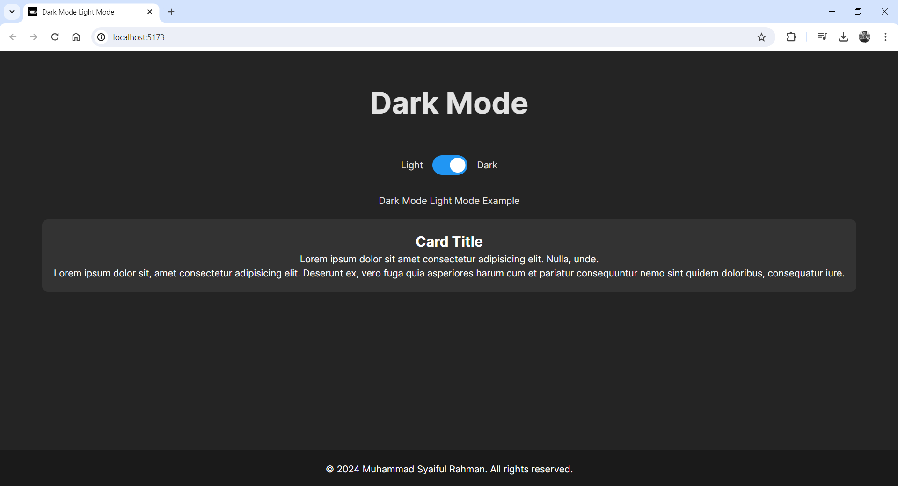
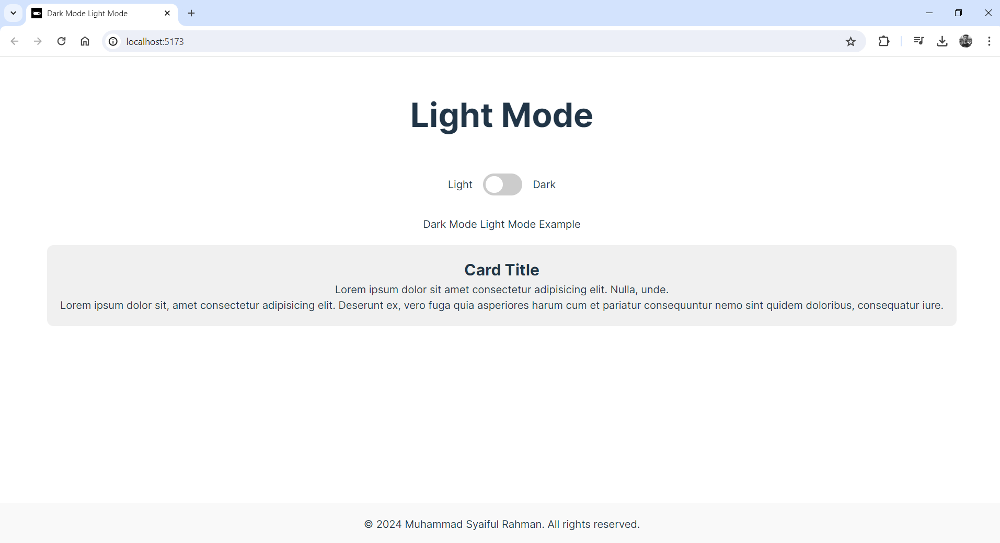

# React + Vite

This template provides a minimal setup to get React working in Vite with HMR and some ESLint rules.

Currently, two official plugins are available:

- [@vitejs/plugin-react](https://github.com/vitejs/vite-plugin-react/blob/main/packages/plugin-react/README.md) uses [Babel](https://babeljs.io/) for Fast Refresh
- [@vitejs/plugin-react-swc](https://github.com/vitejs/vite-plugin-react-swc) uses [SWC](https://swc.rs/) for Fast Refresh

# Dark Mode Light Mode App (Redux + React JS)

#### 👌 <i>Muhammad Syaiful Rahman</i> 👌 

## Brief Steps
- Download ZIP file dari repository projek ini
- Buka folder projek dengan code editor (VSCode, sublime text, dll)
- Buka terminal code editor
- `npm i`
- `npm run dev`

## Screenshots (Preview)

  

  

